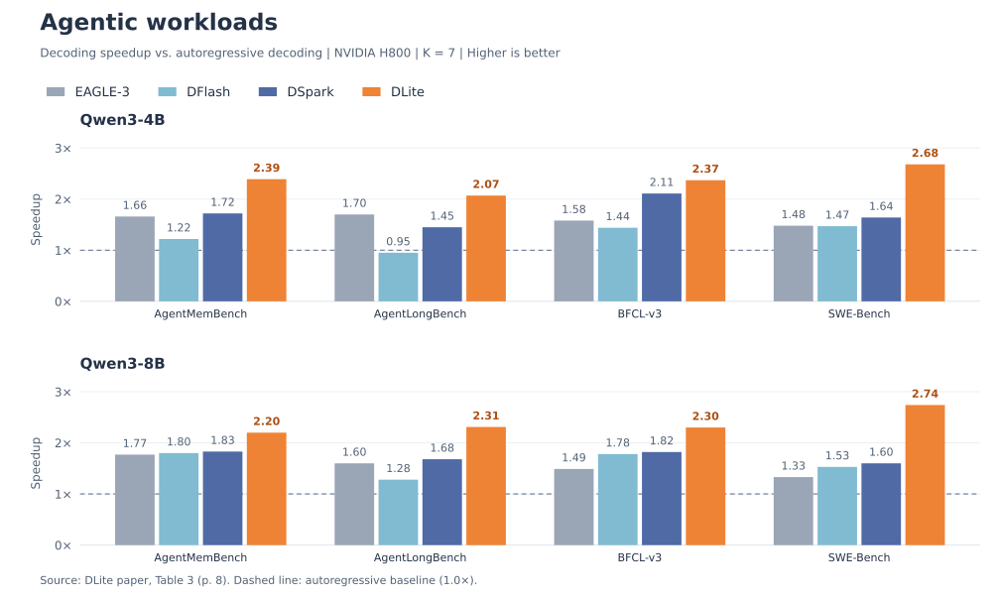
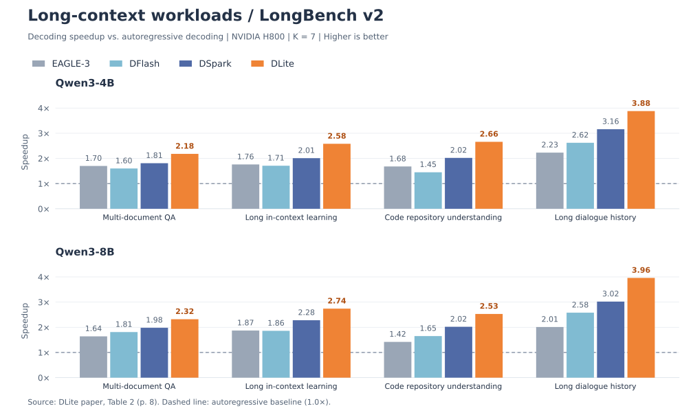
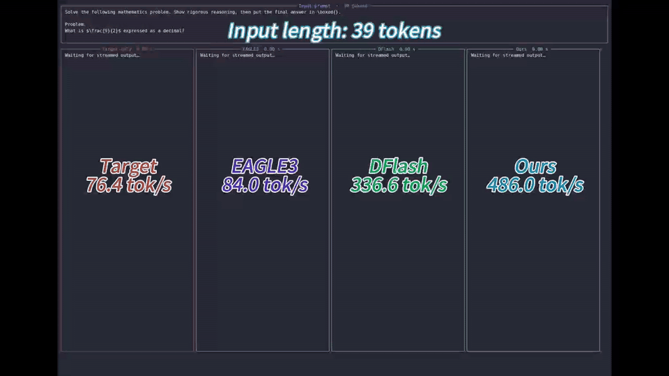
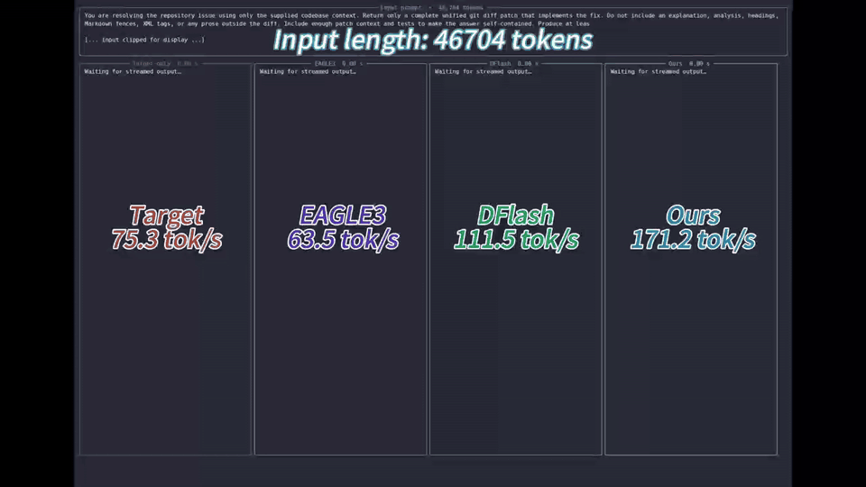

<p align="center">
  
</p>

<h1 align="center">DLite: History-free Speculative Decoding for Agentic AI</h1>

<p align="center">
  <a href="https://github.com/SJTU-DAI-Sys/DLite">
    
  </a>
  <a href="https://huggingface.co/collections/SJTU-DAI-Sys/dlite">
    
  </a>
  <a href="https://github.com/SJTU-DAI-Sys/DLite/blob/main/attachments/DLite_Arxiv.pdf">
    
  </a>
  <a href="pyproject.toml">
    
  </a>
  <a href="LICENSE">
    
  </a>
  <a href="https://github.com/SJTU-DAI-Sys/DLite/issues">
    
  </a>
  <a href="https://github.com/SJTU-DAI-Sys/DLite/pulls">
    
  </a>
</p>

**DLite** is a history-free speculative decoding framework for agentic AI.
It reuses contextual hidden states from the target model to predict draft tokens
without maintaining a historical draft KV cache. A lightweight sequential head
restores dependencies within each speculative block, while a two-stage training
strategy aligns the draft model with the target model.

This repository provides the inference release for Qwen3, including a Python API,
a CLI, and a JSONL throughput benchmark. Draft checkpoints are available in our
[Hugging Face collection](https://huggingface.co/collections/SJTU-DAI-Sys/dlite).

## ⚡ Performance

### Evaluation

The following results are reproduced from **Tables 2 and 3** of the
[paper](attachments/DLite_Arxiv.pdf). Experiments use **NVIDIA H800 GPUs**,
**Qwen3-4B / Qwen3-8B** target models, and a **speculative block size of K = 7**.
Bars show end-to-end decoding speedup over vanilla autoregressive decoding
(**1.0×**, dashed line); higher is better.

**Agentic workloads.** DLite achieves **2.07–2.74×** speedup across the reported
agentic benchmarks. On SWE-Bench with Qwen3-8B, it reaches **2.74×**, compared with
DSpark's **1.60×** (about **71% higher speedup**).



**Long-context workloads.** On LongBench v2, DLite achieves **2.18–3.96×** speedup
across multi-document QA, long in-context learning, code repository understanding,
and long dialogue history.



For general-purpose workloads, Table 1 reports DLite's average acceptance length
of **3.64–6.48 tokens** across math, coding, and chat benchmarks. Table 4 reports
throughput at concurrency levels from 1 to 64. See the paper for all results and
Appendix A.2 for agentic benchmark settings; BFCL-v3 results exclude tool-execution
time. The chart data and plotting code are in
[`assets/plot_performance.py`](assets/plot_performance.py).

### Demo

**Short input · 39 tokens**

[](attachments/short_with_len.mp4)

[▶ Watch the short-input video](attachments/short_with_len.mp4)

**Long input · 46,704 tokens**

[](attachments/long_with_len.mp4)

[▶ Watch the long-input video](attachments/long_with_len.mp4)

The previews above loop automatically. Click a preview or video link to open the
original MP4.

## 🤗 Supported Models

DLite draft checkpoints are paired with specific target models. The
[Hugging Face collection](https://huggingface.co/collections/SJTU-DAI-Sys/dlite)
currently lists the following repositories:

| Target model | DLite draft checkpoint | Availability |
| --- | --- | --- |
| [Qwen3-4B](https://huggingface.co/Qwen/Qwen3-4B) | [SJTU-DAI-Sys/Qwen3-4B-DLite](https://huggingface.co/SJTU-DAI-Sys/Qwen3-4B-DLite) | Weights available |
| [Qwen3-8B](https://huggingface.co/Qwen/Qwen3-8B) | [SJTU-DAI-Sys/Qwen3-8B-DLite](https://huggingface.co/SJTU-DAI-Sys/Qwen3-8B-DLite) | Weights available |
| [Qwen3.5-4B](https://huggingface.co/Qwen/Qwen3.5-4B) | [SJTU-DAI-Sys/Qwen3.5-4B-DLite](https://huggingface.co/SJTU-DAI-Sys/Qwen3.5-4B-DLite) | Model card only; weights pending |

Availability checked on October 10, 2026. The current Python API and CLI target
Qwen3; the Qwen3.5 entry is listed for release tracking.

## 🗺️ Roadmap

- [ ] Integrate DLite into [SGLang](https://github.com/sgl-project/sglang).
- [ ] Integrate DLite into [vLLM](https://github.com/vllm-project/vllm).
- [ ] Train and release DLite draft models for larger target models.

We welcome developers to help build DLite! Contributions to new model support,
serving integrations, benchmarks, and inference optimizations are welcome through
[issues](https://github.com/SJTU-DAI-Sys/DLite/issues) and
[pull requests](https://github.com/SJTU-DAI-Sys/DLite/pulls).

## 📦 Installation

```bash
pip install -e .
```

FlashAttention 2 is optional. When installed, `attention_backend="auto"` uses
it; otherwise DLite falls back to SDPA.

## 🚀 Quick Start

### Python API

```python
from dlite import DLiteEngine

engine = DLiteEngine.from_pretrained(
    target_model="/path/to/Qwen3-8B",
    draft_model="/path/to/dlite-student",
    attention_backend="auto",  # auto, eager, sdpa, flash_attention_2
)
result = engine.generate("Explain speculative decoding in one paragraph.")
print(result.text)
print(result.stats)
```

The draft checkpoint must use `DLiteDraftModel`, `dlite_config`, architecture
version `dlite_v1`, and `sequential_head: "rnn"`.

### CLI

```bash
dlite \
  --target-model /path/to/Qwen3-8B \
  --draft-model /path/to/dlite-student \
  --prompt 'Write a CUDA optimization checklist.'
```

For stochastic decoding, set a positive `--temperature` and optionally use
`--verification-mode rejection`. Greedy decoding uses `match` verification.

## 📊 Benchmarking

Create a JSONL file with one `prompt` string per line, then run:

```bash
dlite-benchmark \
  --target-model /path/to/Qwen3-8B \
  --draft-model /path/to/dlite-student \
  --prompts prompts.jsonl \
  --max-samples 100 \
  --output benchmark-results/run.json
```

The report includes generated-token throughput and mean accepted block length.

## 🗂️ Repository Layout

```text
dlite/
├── engine.py          # Public loading and generation API
├── cli.py             # `dlite` command
├── benchmark.py       # `dlite-benchmark` command
├── modeling/
│   ├── dlite.py       # Qwen3 DLite model and decoding loop
│   ├── qwen3.py       # Attention and decoder layers
│   └── sequential_head.py
└── utils/
    ├── hidden_states.py
    └── sampling.py
```

Model classes are available from `dlite.modeling`; normal users only need the
top-level `DLiteEngine` API.
